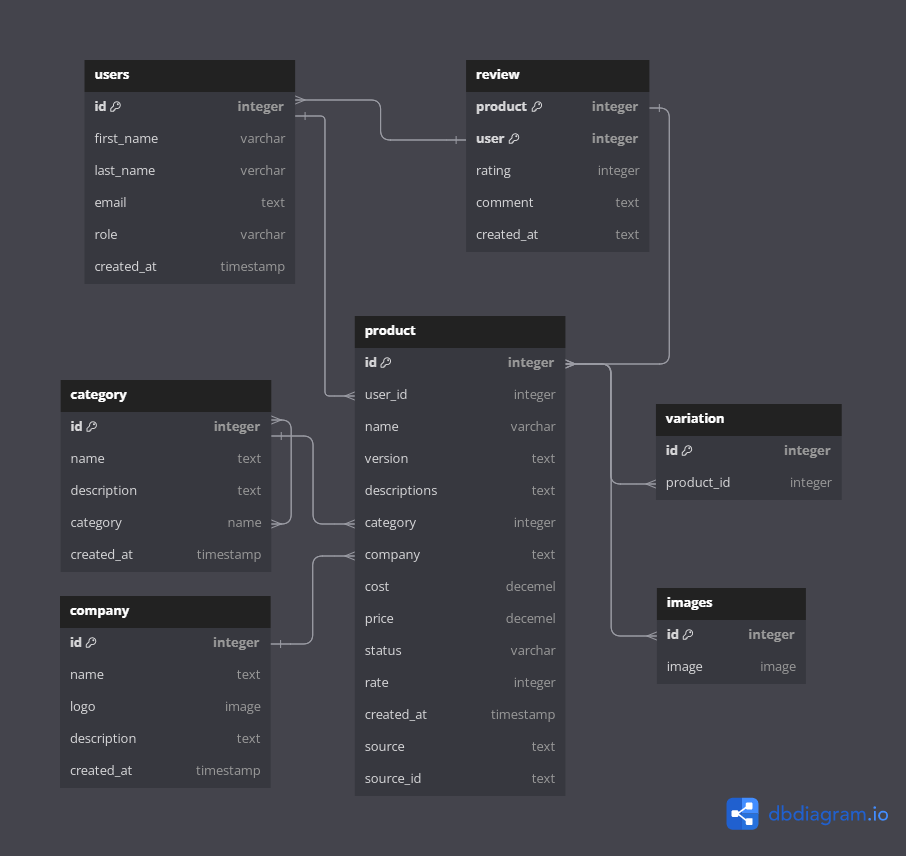

**3A_SHOP README**
======================

**Project Overview**
-------------------

3A_SHOP is an e-commerce platform that specializes in selling electronic accessories. This project aims to provide a user-friendly and efficient online shopping experience for customers.

**Project Structure**
---------------------

The project is structured as follows:
```markdown
├── backend/
│   ├── core/
│   │   ├── templates/
│   │   │   └── (template files)
│   │   ├── static/
│   │   │   └── (static files)
│   │   ├── admin.py
│   │   ├── apps.py
│   │   ├── models.py
│   │   ├── tests.py
│   │   └── views.py
│   ├── manage.py
│   ├── project/
│   │   ├── asgi.py
│   │   ├── settings.py
│   │   ├── urls.py
│   │   └── wsgi.py
│   ├── staticfiles/
│   │   └── (collected static files)
│   ├── media/
│   │   └── (uploaded media files)
|   ├── .env.example
│   └── .env
|
├── frontend/
|   └──
|
├── requirements.txt
├── project_digram.codediagram
├── .gitignore
├── README/
└── venv/
```
**Configuration and Development**
---------------------------------

### Step 1: Clone the Project

Clone the project from the repository using the following command:
```bash
git clone https://github.com/your-username/3A_SHOP.git
```
### Step 2: Create a Virtual Environment

Create a virtual environment using the following command:
```bash
python -m venv venv
```
### Step 3: Activate the Virtual Environment

Activate the virtual environment using the following command:
```bash
source venv/bin/activate
```
### Step 4: Install Dependencies

Install the dependencies listed in the `requirement.txt` file using the following command:
```bash
pip install -r requirement.txt
```
### Step 5: Configure Environment Variables

Create a new file named `.env` and copy the contents of the `.env.example` file into it. Update the environment variables as needed.

### Step 6: Run the Project

Run the project using the following command:
```bash
python backend/manage.py runserver
```
### Step 7: Access the Project

Access the project by visiting `http://localhost:8000` in your web browser.

**Database Diagram**
--------------------

The database diagram is represented in the `project_digram.codediagram` file. The diagram shows the relationships between the different tables in the database.

**DB Diagram Image**
--------------------



**Development**
--------------

To contribute to the project, please follow these steps:

* Fork the project repository
* Create a new branch for your feature or bug fix
* Make changes to the code and commit them
* Push the changes to your forked repository
* Create a pull request to the main repository

## License

For more details, visit [Creative Commons](https://creativecommons.org/licenses/by-nc/4.0/).

## Contact

For any questions or concerns, please contact:  
**Your Name**: Amr Bakar  
**Your Email**: amr6000baker@gmail.com   
**GitHub Profile**: [My GitHub Profile](https://github.com/codeBOKER)
